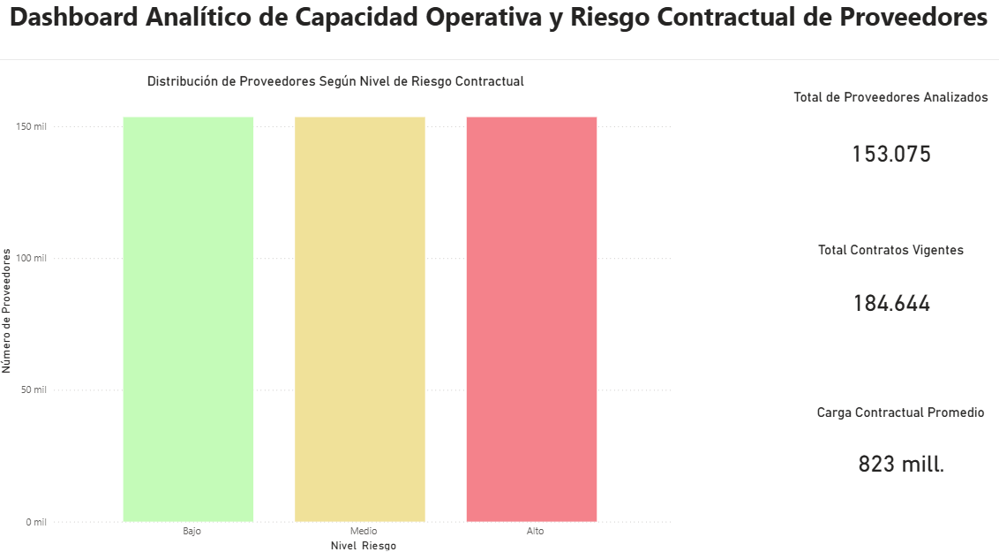

# tfm_capacidad_residual_operativa
Análisis de la capacidad operativa y residual de contratistas en la contratación pública Colombiana mediante técnicas de ML
## Dashboard Analítico

## Informe de Visualizaciones

Las visualizaciones generadas durante el análisis pueden consultarse en el siguiente documento:

[Ver visualizaciones del proyecto](DB_TFM_PRELIMINAR.pdf)
